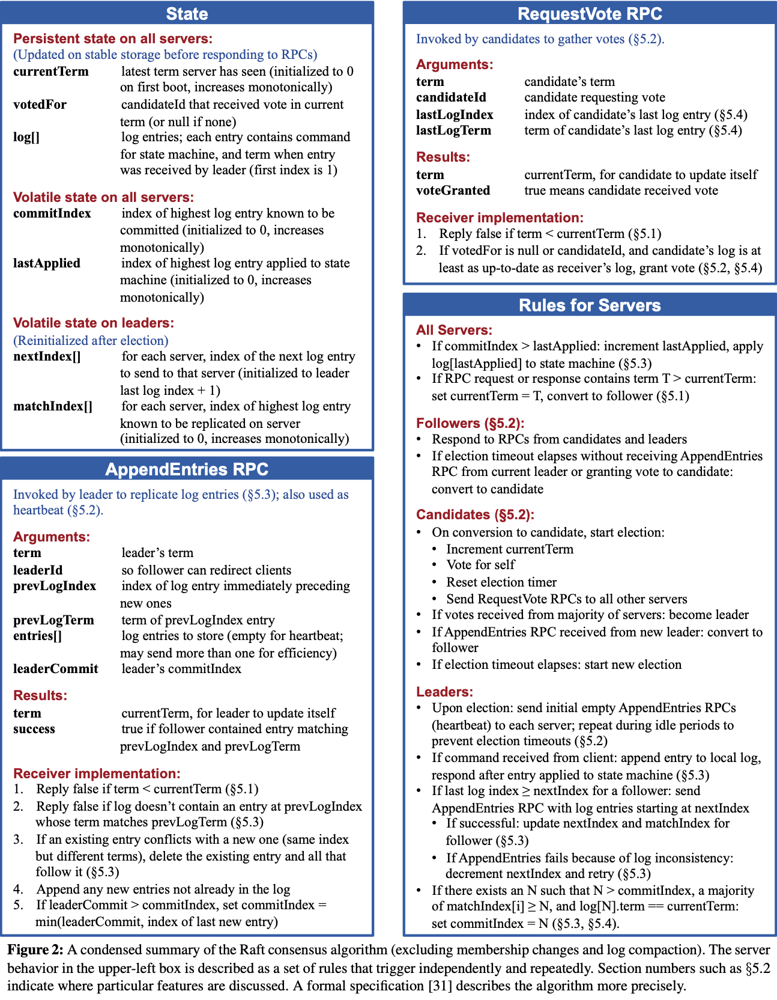

 <!--more-->

 # 分布式与数据库的爱恨纠葛 之 Raft算法


分享人：刘子东

日期：2020月8月18日

[TOC]


## 背景及说明


###为什么要学习并分享？

1. 使用广泛，服务治理、分布式协调、分布式存储等等等等等。虽说每个工业实现都略有区别，但是整体思想都是基于原始论文的基础上优化。
   1. 相关紧密的项目
      1. orchestrator
      2. consul
      3. tikv/pd - TiDB
      4. etcd - Kubernetes
      5. mongodb（v3.2及以上，raft-like（secondary拉取等））
2. 提高个人及团队对分布式系统的理解程度，能完成相关项目调试/调优/开发，提高服务质量。
   1. 帮助进一步理解内部项目
   2. 帮助理解分布式数据库的一些重要配置及其对业务的影响（如mongodb的读写concern等）


### 分享包含哪些内容？

1. 分布式系统中的一致性等基础概念
2. Raft算法核心思想及其实现过程
3. Raft算法在工业实现过程中需要考虑的一些拓展内容


### 个人实验项目

https://github.com/sylzd/MIT_6.824_2020/tree/master/lab2_raft


## 学前班


### 分布式基本概念


**分布式与并发**

- 区别：
  - 概念层次不同：前者是物理资源概念、后者是业务概念
  - 单机也能并发：单机也有多核CPU，锁，原子操作等方式来解决并发问题，不一定非要上分布式。比如单实例MySQL，通过innodb中的各种锁保证*并发*线程操作临界资源的正确性，一定程度上解决并发问题。同样，缓存方法也是解决高并发的一种方式。
- 联系：
  - 常常一个复杂系统需要通过分布式的基础设施去应对高并发难题。
  - 有些子问题和解决方案类似，比如`happens-before问题`，下面要说的`数据一致性`问题等


**数据一致性：**


这里以wiki说法为准，但由于与多核并发中的术语相同且定义的年代不一样，可能部分文章存在一定混淆。

只讨论一些较强的一致性


- 近义词辨析（尤其是分布式数据库会同时包含ACID+CAP设计）
  - coherence： 一般特指`cache coherence`缓存一致性，多核CPU缓存数据一致
  - consensus:  共识，是一个过程，分布式系统是其场景、分布式一致性是其目标。Raft就是一个典型的用来解决一致性问题的共识算法
  - consistency - ACID: 事务开始到事务结束时，数据的完整性没有被破坏，包括[约束](https://zh.wikipedia.org/wiki/数据完整性)、[触发器](https://zh.wikipedia.org/wiki/触发器_(数据库))、[级联回滚](https://zh.wikipedia.org/wiki/级联回滚)等预设的约束。从一个一致性状态转到了事务期望的另一个一致性状态，而不存在某个中间态，比如最常用的转账的例子；个人感觉ACID中的C不是很好理解，个人理解是通过A和I实现的，只是A侧重说可以回滚，I侧重说事务之间的关系，而C则想说明可以通过一批操作完成一个想要的复杂的状态的转换。
  - consistency - CAP:  不同的节点对相同的请求返回相同的数据; 类似广播体操？（手动狗头）


- 严格一致性(Strict Consistency)：客观上的强一致，和单机系统一样，所有副本立刻同步更改数据，所有读操作都能读到最新数据，由于网络延迟，全局时钟等原因，基本不可能实现

- **线性一致性/原子一致性**(Linearizability/atomic consistency)：主观上的强一致,（有的文章粗略的认为就是严格一致性）

  - 不要求立刻同步数据，但是要求对于读写操作序列，读到的值都是在此读操作之前最后一次写操作的值
  -  系统中的所有进程,看到的操作顺序,都与全局时钟下的顺序一致。

- 顺序一致性(Sequential consistency)：用了逻辑时钟代替全局物理时钟，相比线性一致性少了全局时钟下的顺序一致，但所有进程看到的顺序是一致，但不代表是真实发生的顺序。

  ```
  兰伯特定义：
  the result of any execution is the same as if the operations of all the processors were executed in some sequential order, and the operations of **each individual processor appear in this sequence in the order specified by its program**
  ```

  - 任何一次读写操作都是按照某种特定的顺序。（但不一定与实际物理时间相同的顺序，如下图某个进程的读操作未必能及时得到此前（实际时间）其他进程对同一数据的写更新）

  - 所有进程（客户端）**看到的**读写操作顺序都保持一致。

    

- 因果一致性（Causal consistency）:  通过提高并行率来提高性能，如MongoDB-3.6（读写Concern都是Majority时），朋友圈评论可见性在跨数据中心同步上的应用

  - 所有进程必须以相同的顺序看到**具有因果关系**的读写操作（因果关系：happens before关系的有向无环图）
  - 不同进程可以以不同的顺序看到并发的读写操作

- FIFO一致性：实际使用可以把有因果关系的数据进行归集，放到一个分区用一个进程写入，例如kafka等消息队列。

  - 以一个进程的写入操作为参考系，所有进程的读操作必然是按照这个参考系的顺序

- ...

- 最终一致性


### Raft与一致性

- Raft本身并不能达到线性一致性，他只负责commit的日志有序及全局唯一，需要配合状态机的日志应用层（即存储引擎）来功能实现，并且他也借用了逻辑时钟的思想，以下是Raft实现线性一致的方式
  - LogRead:
    - Raft能使所有节点的日志全序且一致，如果所有节点按顺序应用读写操作日志即可达到线性一致
    - 性能较差（优化方式见拓展）


### Raft相关术语


**角色：**

leader, follower, candidate

- leader处理所有客户端请求，即便follower收到请求也会重定向到leader
- follower是普通的被动状态，和leader/candidate交互
- candidate在选举时由发起选举的follower变成，是一个中间状态


**状态机：state machine**

在分布式系统中指基于复制状态机模型中的一个**负责执行状态命令，维护状态信息**的一个抽象名词，可以简化理解为高可用集群中的一个节点，这些节点通过一致的初始状态+一致的状态变化达到状态的完全一致。


**任期:** term

不依赖系统时钟的逻辑时钟

- 每个任期都有且仅有一个leader
- 一轮新的选举会生成一个新的任期
- 选举失败的任期就会非常短


**RPC:**

- 节点之间交流的方式
- 有两个RPC
	- `RequestVote`: candidate对其他follower发起投票
  - `AppendEntries`: leader将日志复制给其他follower


1. Raft动画

   帮助理解大致过程，http://thesecretlivesofdata.com/raft/


   **规则**

   这5条限制性规则，贯穿代码编写的始终，先实现前者，在前者的基础上能实现后者。（5.4证明实现了3，4，5）

   1. 选举安全：每个任期最多一个leader(5.3 选举过程实现)

   1. leader只能添加日志：只有leader能且仅能添加日志，而不能删除或更新日志条目 （代码仅给leader append接口）
   2. 日志匹配原则：集群中如果两个日志的term和index一样，那么这个日志从头到这个index位置之间全部完全相同 （1+2+选举限制安全机制+覆写机制）
   3. **leader完备性**：一条日志条目在任期内committed，那么这个日志条目一定会出现在后面任期的leader日志中 （1+2+3+选举限制安全机制）
   4. 状态机安全：如果一个节点应用了一条日志条目在状态机中, 所有节点都不能应用和这个日志条目的index相同但不一样的日志 （4+日志和数据不一致安全机制）


2. Raft设计与实现概览

- 共识算法，达到线性一致性的目标

- 划分为3个子问题：选举、日志复制、宕机恢复

- 设计图：（实验中需要实现的点大都在这张图里）




## Raft实现（对着源码讲）


### 1. 选举

#### 思路

leader通过心跳机制与follower保持联系，失联会触发选举。选举时，所有节点平等，自己选举的时候，也能给别人投票，直到选举结束。

#### 主要逻辑

1. 初始化触发选举
   1. 初始化时，大家都是follower
   2. 大家都会初始化一个`半随机`的ElectionTimeout
   3. 第一个ElectionTimeout时，发出选举RPC

2. leader失联触发选举
   1. leader失联后，follower收不到leader的心跳（超出ElectionTimeout）
   2. 发生ElectionTimeout的节点, 发出选举RPC

3. 选举过程
   1. 触发选举后，可以给其他节点发送选举RPC请求拉票，其他节点处理RPC请求：
      1. Follower选举者收到RPC请求，根据选举的限制规则决定是否投票，并返回给选举者
      2. 之前的leader从灾难中恢复收到RPC请求，会发现自己的任期小于当前任期数，主动退化为follower
   2. 拉完一轮票后，如果票数超过半数，则选举成功
   3. 如果一轮term过后，所有节点都没有选举成功(当ElectionTimeout恰好完全相等时可能会发生)，或选举出两个leader, 则重来，触发下一轮term选举


#### 选举限制安全机制

 如下面这段`RequestVote`RPC的代码，通过各种选举限制手段，将当前Term的Leader控制在1个，且Leader中的日志为最新。

```go

	// 1. 选举限制：候选人term太小，不投
	if args.Term < rf.term {
		DPrintf("candidate:%d term too old", args.CandidateId)
		return
	}
	// 2. 选举限制：候选人日志较旧（term较小或term相同的情况下，候选人index太小）·，不投
	lastLogTerm, lastLogIndex := rf.lastLogTermIndex()
	if args.LastLogTerm < lastLogTerm || (args.LastLogTerm == lastLogTerm && args.LastLogIndex < lastLogIndex) {
		DPrintf("candidate:%d log too old", args.CandidateId)
		return
	}
	// 3. 我是leader，不投
	if rf.role == Leader {
		DPrintf("i am leader", args.CandidateId)
		return
	}

	//4. 已投给其他节点，不投
	if rf.votedFor != -1 && rf.voteFor != args.CandidateId {
		return
	}
```


### 2. 日志复制

#### 思路

leader通过心跳机制	与follower保持联系，并在心跳中带上需要Append的log，当大多数节点完成复制并返回给leader时，leader则apply该log到状态机。follower会在后面的心跳中收到最新提交的日志，并apply到自己本地的状态机。

#### 主要逻辑

1.  **请求转给raft ：**raft层接收到转发过来的客户端请求，开始执行操作`Start(command)`，并开始日志复制，并立即返回（index, term, isLeader），不用管结果。
2. **raft完成日志大多数提交**：leader发送`AppendEntries`RPC请求，每次都获取新日志复制结果，直到完成日志**大多数提交**
3.  **leader应用日志**：更新自己的`commitIndex`，并将`ApplyMsg{command, index}`传给一个`applyCh`, 状态机从`applyCh`中读取消息后，开始执行请求，并返回给客户端

4. **follower应用日志**：follower收到下一个`AppendEntries`请求((为了减少消息来回次数))中的`LeaderCommit`(即leader的`commitIndex`，已提交日志的最大index)时，开始apply日志到自己本地的状态机，直到达到`LeaderCommit`

#### 日志复制安全机制

在以上主逻辑正常情况下，Leader不会改变，每一个日志都会正常在每一个节点上应用。而处理日志复制安全机制比主逻辑复杂许多，或者说在分布式系统中，单节点或少量节点的故障是常态而非异常，所以节点的故障处理也是分布式一致性协议的主逻辑之一。以至于分布式系统需要采用`面向故障的设计方法`（这个是在做备份系统的时候一个惨痛教训，实现没有对可能存在的网络等故障做细致思考，后期花费了大量精力来做弥补，从95%->99%）

1. 非Leader挂掉：`TestFailAgree2B`3个节点中的1个节点(非leader)挂掉后，剩下2个节点依然能通过`majority`提交日志；而Leader会无限期重试发送`AppendEntries`给挂掉的节点，以确保所有的`follower`都存储了这条`log entry`，即使已经返回给客户端结果了也会重试通过apply补偿，逐步追回。


2. leader挂掉: 会发生不一致的情况（详细情况如下图）

   

   a. follower的日志仅仅比leader少1个条目, 比较正常的情况

   b. follower的日志比leader少了多个条目，这种情况follower有些延迟

   c. follwer的日志比leader多，但还在一个任期

   d. follwer的日志比leader多, 且任期比leader还大

   e. follwer的日志跟leader的历史日志不一样

   f.  follwer的日志跟leader的历史日志不一样，且follower日志index还要大


3. 通过以下一致性检查步骤能恢复一致性（应对上述a-f所有情况），主要思路就是**leader会强制覆写follower的日志**（由于leader的日志一定是大多数的，所以可以放心覆写

   - `AppendEntries`RPC请求中加入日志的一致性检查：
     - 检查项1：leader的 (prevLogTerm, prevLogIndex）（新日志前一条日志）与follower不匹配，则说明不一致
     - 检查项2：follower中的历史日志有与leader不匹配的，则删除该不匹配日志及之后所有日志
     - 检查项3：follower中的日志缺失太多，比prevLogIndex要小

   - 一致性修复：对应`nextIndex`回退一格（leader的nextIndex[followerID]-1），下一次leader会多发送一条历史日志，用来覆写follower的不合群或不存在的日志，通过迭代回退，最终所有日志会趋于一致。

  - a修复：正常，直接复制新条目即可
     - b修复：follower直接告诉Leader从我的最后一个日志后面一个索引发AE或一次次回退到正确位点,来补全日志（检查项3）
     - c修复：follower多出来的这个由于没有提交，等Leader再来一条日志后，Term一定大于6（图中是8）（检查项2，出现在网络分区时假Leader有新未提交日志，后来回退为follower时，但后面Leader的term一定会比这个大，所以会覆写掉）
     - d修复：发现prev不匹配并覆写不一致的记录（检查项1）
     - e修复：发现prev不匹配并覆写不一致的记录（检查项2）
     - f修复：发现prev不匹配并覆写不一致的记录（检查项1）


  如下面这段`AppendEntries`RPC中代码中的一致性检查，会检查Follower中日志不一致的情况，并由Leader中的日志覆写

  ```go
  	// 1. 一致性检查(leader crash 会出现): (prevLogTerm, prevLogIndex）新日志前一条日志不匹配(index一样但term不一样),则leader[followerID].NextIndex回退一格，覆写冲突日志
  	// Reply false if log doesn’t contain an entry at prevLogIndex whose term matches prevLogTerm (§5.3)
  	if args.PrevLogIndex > 0 && args.PrevLogIndex <= len(rf.logEntries)-1 && rf.logEntries[args.PrevLogIndex].Term != args.PervLogTerm {
  		reply.Success = false
  		// 告诉leader，一致性检查没通过，删掉不匹配日志，将NextIndex-1
  		rf.logEntries = rf.logEntries[:args.PrevLogIndex]
  		reply.NextIndex = args.PrevLogIndex
  		return
  	}

  	// 2. 一致性检查(leader crash 会出现)：follower历史日志与新的append日志冲突，则删掉冲突日志及之后的所有日志，且leader[followerID].NextIndex回退到剩余日志的末尾
  	// If an existing entry conflicts with a new one (same index but different terms), delete the existing entry and all that follow it (§5.3)
  	for _, entry := range args.Entries {
  		if entry.Index < len(rf.logEntries) && rf.logEntries[entry.Index].Term != entry.Term {
  			rf.logEntries = rf.logEntries[:entry.Index]
  			reply.Success = false
  			reply.NextIndex = entry.Index
  			return
  		}
  	}

  	// 3. 一致性检查(leader crash 会出现)：follower日志缺失太多,则leader[followerID].NextIndex回退到日志的末尾
  	// Append any new entries not already in the log
  	if args.PrevLogIndex > len(rf.logEntries)-1 {
  		reply.Success = false
  		reply.NextIndex = len(rf.logEntries)
  		return
  	}
  ```


4. 需要注意的一种合法情况：如果leader仅复制到大多数节点，但是没提交条目，那么这个**“大多数”依然可能被覆盖掉**，且这个覆盖是被允许的


但是要确保被覆盖的条目没有被执行，我们要避免的是覆盖已提交条目而产生的不一致现象（即日志条目与实际应用到状态机的条目不符，从而影响状态机安全性）。如下图展示了一种情况，a-d是按时间顺序排列的5个切面。e和d切面是同一时间的另一种情况，两者都是正常的情况.(后来作者把d、e改成了d1,d2)


以时间为切面

切面a: S1正常发送了日志条目给S2

切面b: S1挂掉，S5成功当选leader，并产生`term3-index2条目`(不满足大多数条件)

切面c: S5挂掉，S1成功当选leader，并产生`term4-index3条目`，且继续复制`term2-index2条目`到S2，此时`term2-index2条目`已满足大多数条件，但未提交。

切面d: S1再次挂掉，S5再次当选leader(`term2-index2条目`不满足**大多数且已提交**条件)，此时leader继续复制`term3-index2条目`到所有节点，并覆盖了`term2-index2条目`

切面e（**和d切面是同一时间的另一种情况，两者都是正常的情况**）:S1提交了`term4-index3`条目，那么之前的条目（`term2-index2条目`）都会被间接提交。此时 `term2-index2条目`满足了大多数已提交条件，那么S5就不会当选为leader，最终（`term2-index2条目`）占领该位置。


### 3. 宕机恢复

#### 思路

前面两种方式主要是关注了集群下网络分区的问题（如 S1 无法连接到 S2），这里会关注节点实例宕机或重启的问题：应对节点内存数据的丢失。。

#### 主要逻辑

1. 将`currentTerm`、`votedFor`、`log`3个状态变量在每次变更的时候持久化到非易失性存储

#### 实现

利用gob库，直接把需要持久化的状态写集群，需要的时候再读出来。

`commitIndex` 状态可以失去是因为，当Leader获取到新的commit的日志时，就知道了之前的日志都已经提交，并通过`AE-RPC`告诉follower。

`lastApplied`状态可以失去是因为，在没有snapshot等大数据量优化（raft论文提供了snapshot思路，每隔一段时间保存快照，重启后从快照开始apply）的情况下，需要从0开始apply到最新的commit日志。

```go
func (rf *Raft) persist() {
	w := new(bytes.Buffer)
	e := labgob.NewEncoder(w)
	e.Encode(rf.term)
	e.Encode(rf.votedFor)
	e.Encode(rf.logEntries)
	data := w.Bytes()
	rf.persister.SaveRaftState(data)
}
```


### 总结

再回看一遍动画


以上通过大量的逻辑和设计都是为了满足，论文开头提的5条规则，如果满足了这5条规则，状态机就能安全（这个安全就代表着在各种状况发生下，数据和Leader仍是一致的，没有丢也没有被改）的应用日志，且选举机制在一定程度上也保证了可用性（可以失去少数节点）。至于如何应用就是kv层或存储引擎做的事儿了。


#### 顺口溜

选举限制保领导

日志复制搞检查

覆写回退修一波

最后都能归原位


#### 5条规则的证明


**规则**

1. 选举安全：每个任期最多一个leader

2. leader只能添加日志：只有leader能且仅能添加日志，而不能删除或更新日志条目
3. 日志匹配原则：集群中如果两个日志的term和index一样，那么他们自己和之前的所有日志条目也全部相同
4. leader完备性：一条日志条目在任期内committed，那么这个日志条目一定会出现在后面任期的leader日志中
5. 状态机安全：如果一个节点应用了一条日志条目在状态机中, 所有节点都不能应用和这个日志条目的index相同但不一样的日志


- 规则1 - 选举安全：每个任期最多一个leader

     参见`Raft实现章节`中的选举限制安全机制，这些规则就是用来保证选举安全的。

- 规则2 - leader只能添加日志：

  如下面这段`Start`Leader接受客户端请求后执行的代码，可以看到Leader只有append操作，没有其他对日志的操作

```go
	// 2. leader 收到client发来的命令，发起一次日志共识过程,并马上返回,不用管结果
	// Leader Rule 2: If command received from client: append entry to local log, respond after entry applied to state machine (§5.3)
	index = lastIndex + 1
	DPrintf("rf:%d send index:%d command:%+v, commited index: %d", rf.me, index, command, rf.commitIndex)
	rf.logEntries = append(rf.logEntries, LogEntry{
		Term:    rf.term,
		Command: command,
		Index:   index,
	})
	rf.matchIndex[rf.me] = index
	rf.persist()
```

- 规则3 - 日志匹配原则：

  归纳法证明

  1. 已知1（事实）：领导人最多在一个任期里在指定的一个日志索引位置创建一条日志条目，且这个条目的位置不会改变

  2. 已知2（日志安全机制）一开始空的日志状态肯定是满足日志匹配特性的，然后一致性检查（见日志复制安全机制）保护了日志匹配特性当日志扩展的时候。因此，每当附加日志 RPC 返回成功时，领导人就知道跟随者的日志一定是和自己相同的了
  3. 结论：如果在两个日志中的条目拥有相同的索引和任期号，那么他们自己和之前的所有日志条目也全部相同，即满足日志匹配特性


- 规则4 - leader完备性(或者叫commit安全性，一条日志条目在任期内committed，那么这个日志条目一定会出现在后面任期的leader日志中)：

  


该规则可以通过前3个规则推导出来，主要思想就是新Leader的日志一定在选举过程中是最新的，在选举过程中，大多数都有commited日志，那么新选举一定有一个拥有commited日志的节点，且他一定会当选Leader。

论文详细证明过程如下，反证法证明：

假设 term T 提交了 一个条目 A， 在 term U （U>T）却没有这个条目。如果与已知条件矛盾，则证明成立。证明过程如下：

1. leader-T复制A到大多数节点中，leader-U获取了大多数节点投票，如上图，至少有1个节点，既收到了条目AE，又为leader-U投票了。（这个节点是矛盾关键，就叫他KeyVoter吧）
2. KeyVoter一定先收到AE,再去给leader-U投票。（如果先投票，那当前term已经到了term-U，会拒绝term-T的条目）
3. leader-U选举过程中，**KeyVoter仍然保存了条目AE**，无论中间换了多少个领导。(我们假定了leader-U是第一个不含条目AE的节点，所以中间由于每一任领导都有条目AE，所以没有覆写KeyVoter,那KeyVoter种的条目AE也一直在)
4. leader-U选举过程中，**leader-U不存在条目AE**。（leader只能添加，不能删除和修改日志）
5. leader-U选举过程中，**leader-U的日志一定比KeyVoter新或一样新**（选举限制机制）
6. 基于5，那么leader-U一定包含了KeyVoter所有日志条目；基于日志条目唯一性,那么leader-U一定包含了条目A；即 3与4 矛盾
7. leader完备性证明完毕


- 规则5 - 状态机安全性（如果一个节点应用了一条日志条目在状态机中, 所有节点都不能应用和这个日志条目的index相同但不一样的日志 ）

  由于日志条目唯一性和commit日志安全性可知，日志按照commit顺序排列且每条日志唯一。而状态机只会应用committed日志，所以状态机应用日志是安全的


## 拓展与讨论


### 只读操作需要写在log里吗？

只读操作优化，这个在Raft论文的`Chapter 7`中有提到，TiKV和etcd都做了实现


- Why

只读操作是可以不写在log中的，因为：

1. 只要请求的是真Leader，数据就不会错
2. 读操作的日志不需要应用也不会改变数据


- What

在此情况下，要保证读的线性一致性，则需要做以下工作：

1. Leader必须知道commit记录的**最新信息**
2. Leader必须检查处理请求前，需要知道自己**是否已经退位**了


- How
  - ReadIndex： 使用最新的commitIndex做为readIndex，有网络请求开销，减小了了raft的log空间开销，避免了读操作落盘开销
    1. leader刚被当选时必然拥有最新的log，只是无法确认commitIndex是否最新，再补发一个空log(no-op entry),如果空log被commit了，则证明commitIndex最新，并当做readIndex
    2. 发起一次心跳，心跳中收到的commitIndex>=readIndex的数量超过半数，则证明自己不会退位，且readIndex已经被安全提交，
    3. Leader等待执行,当applyIndex>=readIndex即可(这一步可以让Follower完成，完成Follower-Read功能)
    4. 返回readIndex的只读操作给客户端
  - LeaseRead: 相比ReadIndex减少Hearbeat开销
    - 也需要获取readIndex
    - 不发送心跳，维护一个与`ElectionTimeout`相等的租期，每次收到majority的心跳后就延长租期，在租期内，肯定不会有新Leader产生。


### 3个节点扩容2个成员变成5节点集群怎么处理？

成员变更


- 联合共识（Joint Consensus）: Raft论文中提出的方法，比较复杂, 这里简单说一下思路，感觉思路可以推广到分布式配置变更

  - 直接动态修改配置有什么问题？

    从3个节点切成5个节点，由于每个节点切换成员配置或加入集群的时间不一样，导致在图中的方框时间切面，出现了分裂，S1、S2形成一个集群，S3、S4、S5形成一个集群。此时如果S2挂掉，那么S1会选自己当leader，S3、S4、S5也会选一个leader如S5；那么这个term就会产生两个leader

  

  - 联合共识的两阶段配置更改法

    

    保证选举和commit日志安全的同时，响应客户端请求，具体证明过程略。

    - **阶段1 - 切换到过渡配置(结合旧新配置)，达到`联合共识`状态**

      -  **`联合共识`规定：**

        1. 日志条目被发送到新旧配置所有节点

        2. 新旧配置的节点都可以成为leader

        3. **成为leader和日志条目的commit需要新配置的大多数同意+旧配置的大多数同意**（避免两个大多数原则的分歧）

    - **阶段2 - 将过度配置切换到新配置**

- 单节点变更（single-server changes）：一个一个加进去集群，由于每次成员变更都有一个节点作为新旧配置的重叠，而这个节点只会投一边，所以只会有一个leader。Raft的作者在2014年提出的一种简单一点的优化方法，https://web.stanford.edu/~ouster/cgi-bin/papers/OngaroPhD.pdf

  1. Leader向 Server 4 同步数据

  2. Leader将Cnew([1,2,3,4])作为日志条目，同步到集群中所有节点

     


### 日志太大怎么办？

日志会随着使用逐渐增多，会影响日志回放速度，且容易超出内存使用，需要持久化旧日志。


日志压缩 - 快照技术


- 思路：每个节点都dump整个系统状态到持久性存储中，丢掉那个时间点之前的内存日志

  

- 需要考虑的一些问题
  - Follower落后太多，Leader内存中已经没有了对应的日志：此时需要发送快照RPC`InstallSnapshot`给Follower(RPC内容，论文中已提到，此处略)，Follower读本地快照并替代Follower的内存中和快照term-index冲突的条目
  - Follower从快照而不是Leader获取日志，违背了`强领导人原则`： 这里论文认为ok，Leader是为了解决一致性问题，而直接回放快照不存在一致性问题 。而且这种大量数据如果从Leader传来，会浪费大量带宽，且增加Leader实现的复杂度
  - 快照建立频率问题：太快则io高，太慢则存储容量风险高，回放慢。根据日志大小固定快照，这个我觉得要可配置
  - Follower读本地快照花费时间问题：Copy-On-Write，减少写入量


### 生产中怎么使用和优化？

除了Raft论文已经提出的一些优化点外，这里简单列举几个工业优化实践

- Multi-Raft

  - 为了支撑大数据量而采用了多个Raft集群，每个Raft集群存放一个数据分片,在TiKV中称这样一个Raft集群为Region（个人感觉这里并不算是对Raft本身的优化，只是用多个Raft达到分片目的）

- 批量化合并IO请求

- 流水线化，也是增大可并行化工作的一种方式


### Raft与分布式数据库有什么关系？

Raft算法只是分布式系统中，多个节点完成数据同步，并满足数据强一致性的一种共识算法。分布式数据库通过这个算法来满足多个节点数据强一致性同步的需求，以期在满足一致性和分区容错性的情况下，也能有相当高的可用性。而这个特点可以应用在分布式数据库中，如TiDB。反例是传统的MySQL的全同步复制也能满足强一致性，但是牺牲了可用性，一个节点挂掉就导致整个集群不可用。


### 常听说Paxos，那是什么?

- 比Raft更早提出的一种共识算法，以难以理解著称。（所以我也不去折磨自己了）相反，Raft以可理解性著称，大家从开头的动画片就能大致理解其思想
- 也有一些较出名的产品是基于Paxos算法，比如MySQL8.0的MGR
- 性能的话，好像没看到有显著证明Paxos有优于Raft的地方，具体还是看工业实现


### Trade-Off - 鱼和熊掌你都想要吗？

一切都是权衡的结果嘛？

虽说相当多的算法都是妥协（空间和时间互换）的结果，但是仍然有这么一些经典算法能够以神奇的方式从100-0或50-50 变成 90 - 90（当然双百分不大现实）


### 我们要怎么用？

应用展望


### 不会吧？就结束了？还有后续吗？

有精力的话

- rocksdb

- LSM树

- gossip


## 参考资料

Raft论文原文：https://pdos.csail.mit.edu/6.824/papers/raft-extended.pdf

MonoDB一致性文档：https://docs.mongodb.com/manual/core/causal-consistency-read-write-concerns/

一致性wiki: https://en.wikipedia.org/wiki/Consistency_model#Strict_consistency

线性一致性与raft: https://pingcap.com/blog-cn/linearizability-and-raft/

TiKV-leaseRead: https://pingcap.com/blog-cn/lease-read/

TiKV-MultiRaft: https://pingcap.com/blog-cn/the-design-and-implementation-of-multi-raft/

SOFAJRaft: https://www.infoq.cn/article/acwsyQNTRtQof*3ivY4X

Raft-github专题主页：https://raft.github.io/

斯坦福6.824分布式系统课程：https://pdos.csail.mit.edu/6.824/labs/lab-raft.html

Raft动画：http://thesecretlivesofdata.com/raft/
