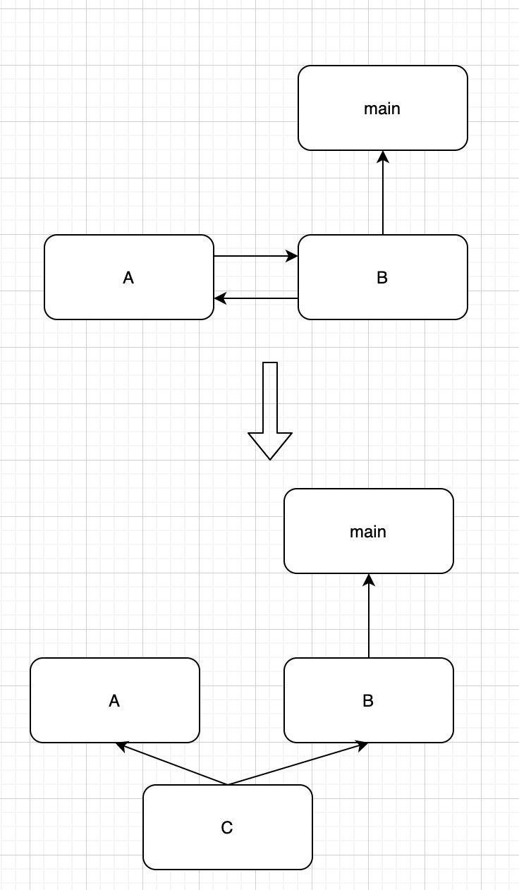
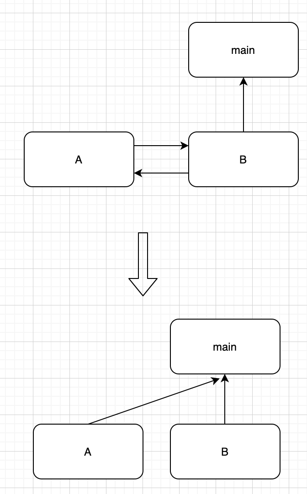

---
title: "软件设计 - 从循环依赖说起"
date: 2020-08-26T20:38:50+08:00
description: ""
draft: false
tags: ["软件工程", "设计模式", "微服务"]
categories: ["设计模式", "分布式"]
--- 

<!--more-->


# 软件设计 - 从循环依赖说起

[TOC]


今天review一个mr，发现代码中依赖了他的上层组件的API，而上层组件又依赖于这个mr所在的项目组件，产生了循环依赖的问题，感觉很有意思~分享一下。

先说结论：不要出现相互依赖或者循环依赖， 最好是单向依赖（高层依赖低层）。


## 什么是循环依赖


假设A是高层组件，B是低层。简单来说，就是A依赖B,B依赖A。（实际开发设计中，一般不允许B反向依赖A）

但是也有环形的，会更加复杂一点，A依赖B,B依赖C，而C又依赖A。


在单体项目中，可能编译器就直接在编译阶段就阻止你循环依赖。比如go语言中`package a`  import了 `package b`,如下面这两段代码。(注意本篇文章代码未经过编译，仅表达思想)

```go
package PA

import "PB"

func Foo(){
    return PB.Foo()
}
```

```go
package PB

import "PA"

func Foo() {
    return PA.Foo()
}
```

```go
package main

import (
	"PB"
)

func main() {
	PB.Foo()
}
```


此时会直接报`import cycle not allowed`错误，从根源上阻止了你在项目中用了`循环依赖`。


## 相关术语


### 依赖倒置原则（Dependency Inversion Principle，简称DIP）

面向对象中的一种解耦依赖关系的原则，程序设计的“[SOLID](https://zh.wikipedia.org/wiki/SOLID_(面向对象设计))”五大原则之一，包含如下：

1. 高层次的模块不应该依赖于低层次的模块，两者都应该依赖于[抽象接口](https://zh.wikipedia.org/wiki/抽象化_(計算機科學))。
2. 抽象接口不应该依赖于具体实现，而具体实现则应该依赖于抽象接口。

好，下面是大白话。

第一条，应用的高层模块只依赖一个抽象，至于抽象怎么由底层来实现，我不care。举个例子，celery异步任务框架中定义了任务队列的抽象，而任务队列的底层用RabbitMQ专业的消息队列工具，还是用Redis，甚至MySQL都可以。

第二条，是说我们在设计依赖关系的时候只用关注抽象，把抽象接口设计好就行了，实现的时候，再面向这些抽象做实现，做面向接口编程。

当然，这个设计原则与循环依赖没有直接关系，但在此原则的基础上衍生的一些设计模式，在一定程度上能避免循环依赖等依赖问题。


### 控制反转（Inversion of Control，缩写为**IoC**）

也是面向对象中的一个原则，但是比`依赖倒置原则`level要低一些，应用场景也更加具体一点。

一般来说Class A中用到了Class B的对象b，一般情况下，需要在A的代码中显式的new一个B的对象。“控制”就这个new对象的过程，这是”控制”手段握在A中，就是”正转“。

然后再来理解”反转“，就是将这个new对象的过程（控制），交给外部。


### 依赖注入（Dependency Injection，简称**DI**）

是”控制反转“最常用的一种方式。

如果对象A依赖对象B，对象B由依赖注入工具（第三方，可以是框架，也可以是工厂等，一般叫做依赖注入容器）实例化，并赋给A中对B的引用。“注入”是指第三方将“依赖”传递给调用方的过程。


## 解决循环依赖

这里以go语言为例


###1. 增加第三方packge


这个最容易想到，提取出公共函数，然后放到`packge C`中，A，B都引用`package C`的函数。不仅能解决问题，也能让人从设计上重新思考架构问题。

这种思想其实，相当于将`packge C`作为了依赖注入的容器，只是没有框架带的依赖注入那么灵活。

把`package C`作为一个工厂，其实是对依赖注入容器的一种编译时的简单实现。




### 2.使用函数或接口传参

- 函数传参

思想很简单，B引用A时，不直接引用，而是提供一个传参的接口。当main函数想用B引用A的方法时，将A的方法以参数的形式，传给B。

抽象一点，在B中方法的参数定义了一个方法的抽象，而恰好A.Foo()恰好满足这个抽象，因此就能在更上层中用B调用A.Foo()了，此时其实是一个更上层的应用同时用了A和B，不存在循环依赖了。

- 接口传参

相对于函数传参来说，只是表达更符合面向对象一些，但原理差不多，代码应该更容易扩展一点。


总的来说，这两种方式思想类似，相比第一种方式往下增加了一层，这种调用方式其实相当于在上面增加了一层来调用A和B,而不直接在B中反向依赖A。




函数传参如下代码：

```go
package PA

import "PB"

func Foo(){
    return PB.Foo()
}
```

```go
package PB

func Foo(f func())  {
    return f
}
```

```go
package main

import (
  "PA"
	"PB"
)

func main() {
  //A调用B
  PA.Foo()
  //B调用A
  PB.Foo(PA.Foo())
}
```


接口传参如下代码：

```go
package PA

import "PB"

type A struct {}

func (a *A) Foo() {
    b = new(PB.B)
    reutrn b.Foo()
}
```


```go
package PB

type FooInterface interface {
    Foo()
}

type B struct {}

func (b *B) Foo(f FooInterface) {
    f.Foo()
}
```


```go
package main

import "PA"
import "PB"

func main() {
  a = new(PA.A)
  b = new(PB.B)

  // A调用B
  a.Foo()
  // B调用A
  b.Foo(a)
}
```


### 4. 依赖注入

java可以使用框架自带的依赖注入，完成这个解耦的过程。go也能通过reflect间接使用运行时的依赖注入，不过比较复杂，如果不能形成框架的话，大多数情况属于过度设计了，本篇文章，暂时不讨论。


### 5. 架构设计
最理想的解决方案，当然就是在架构设计的时候，就不要出现循环依赖的问题，把包的作用都定好，即便无法预知所有需求，在增加包的时候，也要考虑到层级及依赖问题来调整设计。


## 微服务应用中的循环依赖

前面的设计模式大都是讨论单体应用。在微服务和各种分布式应用大行其道的2020年，显然无法简单在编译的时候就提醒你依赖有问题，对设计及代码实现的要求更高了，如果出现了循环依赖，刚上线的时候可能没有发现问题，当服务模块需要迭代升级的时候就蛋疼了。至于微服务中服务拆分的原则或细节，有空可以深入研究一下，但有一点是可以肯定的，就是开头的结论：不要出现相互依赖或者循环依赖， 最好是单向依赖（高层依赖低层）。


